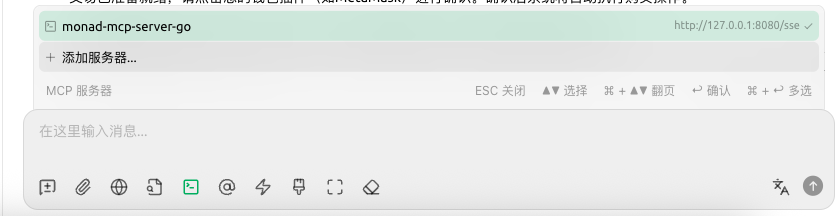

# 1. 概括

目前是基于浏览器模拟操作实现快速跳转到指定 meme 的交易页面，而且仅支持快速选中 `0.5 MON` 后执行交易。

之后我深入研究 RPC 调用，开发出可以更快速的执行交易功能，当前项目只能算打样。

# 2. 如何部署

**需要环境安装**

- go v1.24.0+
- 最新的 chrome 浏览器
- 程序默认端口 `8080` 不被占用

1. 使用 `go build -o monadmcpgo main.go` 编译出二进制程序，或直接运行命令 `go run main.go`

2. 如果是选择编译二进制程序，请保证执行权限 `chmod a+x monadmcpgo`

3. 直接执行二进制程序 `./monadmcpgo`

4. 进入 mcp client 程序，设置 mcp-server 连接配置，例如：

   ```json
   {
     "mcpServers": {
       "monad-mcp-server-go": {
         "name": "monad-mcp-server-go",
         "type": "sse",
         "description": "",
         "isActive": true,
         "baseUrl": "http://127.0.0.1:8080/sse"
       }
     }
   }
   ```

5. 随意选择一个大模型连接设置好的 mcp-server 配置，例如：

   

6. 先提示 AI：”我要 「打狗」“

7. 接着大模型会调用 mcp-server 打开一个浏览器，在里面安装好钱包插件并切换到连接 dapp 的钱包

8. 向 AI 发送任意 meme 合约地址，它会立即操作浏览器跳转到指定合约地址的交易界面，快速选中 `0.5 MON` 后发出交易

9. 在钱包插件确认交易

10. 结束

# 3. 挖坑

等我熟悉链上操作后会更新出可以快速链上交易的 mcp-server。有对 AI 做链上操作感兴趣或者有 AI 功能 idea 的朋友可以提 issue 留下你的 DC / twitter / TG，我会主动联系你 <3